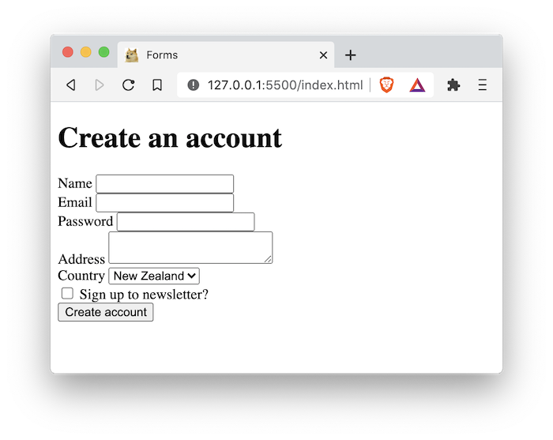
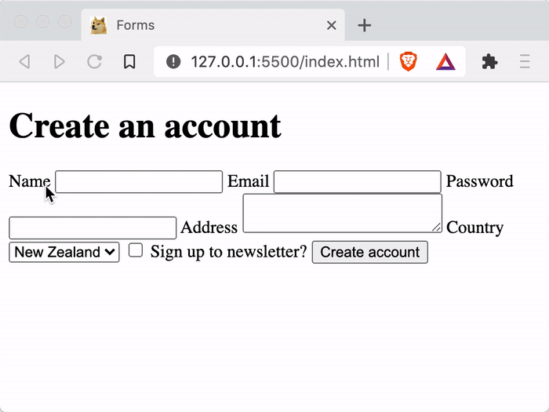
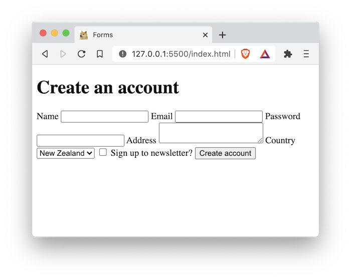
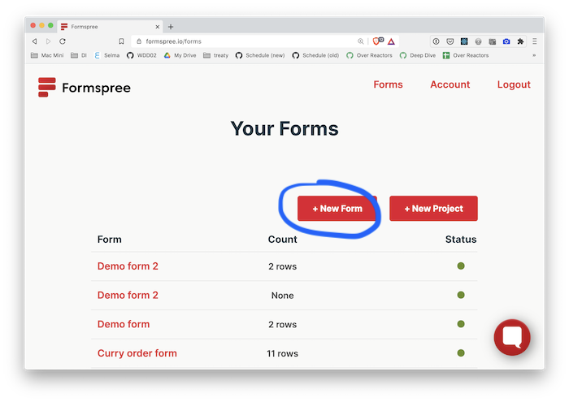
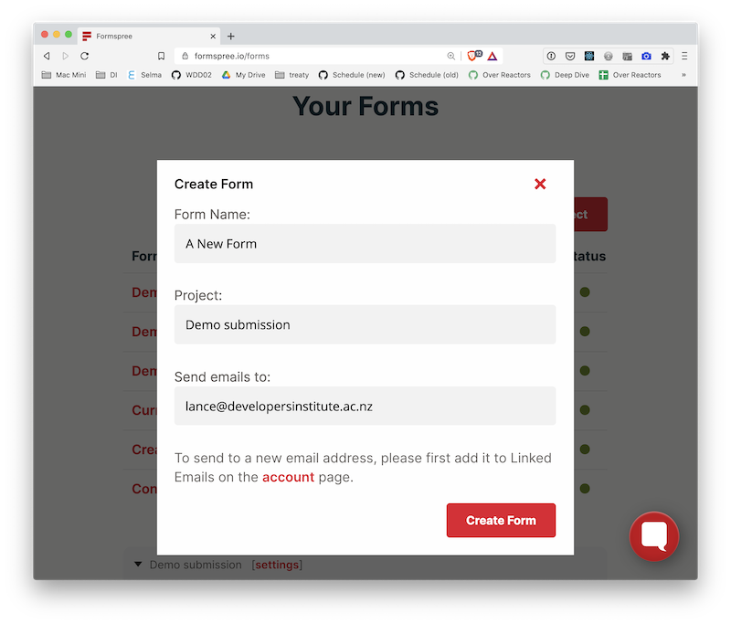
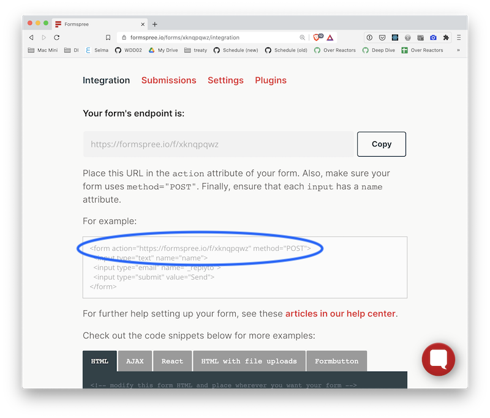

# 01 Exercise - HTML Forms

## Brief

Build a _Create an account_ form with various input types in HTML



---

## Rationale

Almost every web app will use forms in one incarnation or another, so HTML forms will be an important part of your skillset.

---

## Getting Started

1. `clone` the exercise repository to your local computer using VS Code or the Terminal.
2. The code for this exercise should go into the `/Submission` folder.

---

## Exercise Part A - Add Form Elements

1. Create an `index.html` file in the `Submission` folder. Create the HTML base code by typing `!` and pushing `tab`
2. Add a heading inside the body: `<h1>Create an account</h1>` inside the `<body>` element.
3. Create a `<form></form>` element after the `<h1>`
4. Add an `action` and `method` attribute to your form, so it looks like the below snippet:

   ```html
   <form action="https://formspree.io/xgenpywa" method="POST"></form>
   ```

   This will make your form submission be emailed to your instructor.

5. Inside your `<form>` element, add the following HTML form elements, with the corresponding labels and input types.

   - Ensure each of your labels is linked to your input by using the `for` attribute, that matches the `id` of the form input
   - Ensure each of your inputs has the `name` attribute.

     ```html
     <label for="name">Name</label> <input id="name" name="name" type="text" />
     ```

   | Label                  | Input name | Input type | Options                |
   | ---------------------- | ---------- | ---------- | ---------------------- |
   | Name                   | name       | text       | n/a                    |
   | Email                  | email      | email      | n/a                    |
   | Password               | password   | password   | n/a                    |
   | Address                | address    | textarea   | n/a                    |
   | Country                | country    | select     | New Zealand, Australia |
   | Sign up to newsletter? | newsletter | checkbox   | n/a                    |

6. Add a submit button before the closing `</form>` tag:
   - `<button type="submit">Create account</button>`
7. Test your page in your web browser

   - Do your form inputs look correct? For example, does it hide the text when you type your password? Do your checkbox and select work correctly?
   - When you click the label, does it automatically highlight the form input?

     

8. Fill in the form fields and submit the form. All things going well, you should get a success message. If you get an error message, try and fix the error.

9. You will notice all the form elements are on the same line. This is because form elements are `inline` by default.

   

   To make everything appear in its own line, wrap each label/input combination in a `<div>` element. For example:

   ```html
   <div>
     <label for="name">Name</label>
     <input id="name" name="name" type="text" />
   </div>
   ```

10. Ensure your HTML is valid using the [W3C HTML Validator](https://validator.w3.org/#validate_by_input).
11. Commit your code to git

Your form should look like the screenshot below. It's not well designed, but it's functional.


**Acceptance criteria**

- All form fields are present that are listed in the specification
- When clicking a label, it focuses on the corresponding form input
- When a user pushes enter while in a form element, the form submits
- When the form submits, it displays the Formspree confirmation page
- The form inputs have appropriate names, so when the form is submitted the correct data appears in the Formspree email

## Exercise Part B - Make name and email required inputs

It's possible to make form inputs required, by using the `required` attribute. You can read more about [The required attribute on MDN](https://developer.mozilla.org/en-US/docs/Learn/Forms/Form_validation#The_required_attribute)

1. Make the _Name_ and _Email_ form inputs required, by adding the `required` attribute to the inputs.

   ```html
   <input id="name" name="name" type="text" required />
   ```

2. Commit your code to git

**Acceptance criteria**

- If the name input is empty, the form can not be submitted
- If the email input is empty, the form can not be submitted

## Exercise Part C - Create your own Formspree form

You can sign up for your own Formspree account, and configure the form details to be sent to your own email address.

1. Visit https://formspree.io/register to sign up for an account
2. Verify your email address
3. Sign in to Formspree and create a new form. Use your own email address, so when the form is submitted you will get an email.

   

   

4. Copy and paste the provided `<form>` element, replacing your existing one.

   

5. Open your form in your browser, fill it out, and hit submit. You should receive an email.
6. Commit your code to git

**Acceptance criteria**

- When the form is submitted, you receive an email to the address you configured in Formspree

---

# Submit your Exercise

- [ ] Push your code to GitHub by typing `git push`
- [ ] "Mark as done" in Google Classroom

# Walkthrough Solution Videos

- [Part A](https://www.loom.com/share/09d50886832f431cab15d19327fa4224)
- [Part B and C](https://www.loom.com/share/1345c6019be64c1982b5c0400b6b3936)
